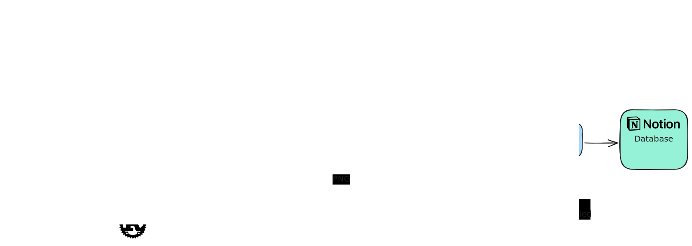

# ReMarkable to Notion Sync

A Rust CLI tool that syncs reMarkable notebooks to Notion with OCR text extraction and full-resolution images.

## Quick Start

1. **Install prerequisites** - See [SETUP.md](SETUP.md) for detailed instructions
2. **Connect reMarkable via USB** and run RemarkableSync
3. **Configure** - Create `.env` file with your API credentials
4. **Run** - `cargo run --release -- sync`

For complete setup instructions, see **[SETUP.md](SETUP.md)**

## Prerequisites

- **ReMarkable tablet** in developer mode
- RemarkableSync to make a local backup
- **Rust** 1.70+ (`cargo --version`)
- **Google Cloud account** (Vision API + Drive API)
- **Notion workspace** with integration token
- **poppler** for PDF conversion (`brew install poppler`)

See [SETUP.md](SETUP.md) for detailed setup steps.

## Installation

```bash
git clone <repository-url>
cd remarkable2notion
cargo build --release
```

## Usage

### Initial Setup

1. **Connect reMarkable via USB** - Ensure tablet is awake
2. **Run RemarkableSync** to create backup in `~/remarkable_backup`
3. **First sync** - Run the tool:

```bash
cargo run --release -- sync
```

Your browser will open for Google OAuth authorization (one-time). The tool will then:
- Extract PDFs from reMarkable backup
- Convert pages to images
- Run OCR with Google Cloud Vision
- Upload images to Notion pages
- Upload PDFs to Google Drive
- Sync tags from reMarkable to Notion

### Regular Syncing

```bash
# After updating notebooks on reMarkable:
# 1. Connect via USB
# 2. Run RemarkableSync
# 3. Sync to Notion
cargo run --release -- sync
```

### Testing

```bash
# Test Notion connection
cargo run --release -- test --notion

# Test OCR
cargo run --release -- test --ocr /path/to/sample.pdf
```

### Logging

Control log verbosity with the `LOG_LEVEL` environment variable:

```bash
# Concise output (default)
cargo run --release -- sync

# Detailed debug logging
LOG_LEVEL=debug cargo run --release -- sync

# Available levels: error, warn, info, debug, trace
LOG_LEVEL=trace cargo run --release -- sync
```

## Architecture



The sync process:

1. **USB Sync**: RemarkableSync extracts PDFs from reMarkable
2. **Tag Extraction**: Reads tags from `.content` files in backup
3. **Image Conversion**: pdftoppm converts PDF pages to PNG
4. **OCR**: Google Cloud Vision extracts handwritten text
5. **Notion Upload**: Images uploaded directly to Notion pages
6. **PDF Backup**: Complete PDFs stored in Google Drive
7. **Tag Sync**: ReMarkable tags synced to Notion multi-select property

## Troubleshooting

See [SETUP.md](SETUP.md) for common issues and solutions.

## Documentation
ssss
- **[SETUP.md](SETUP.md)** - Complete setup guide

## License

MIT
